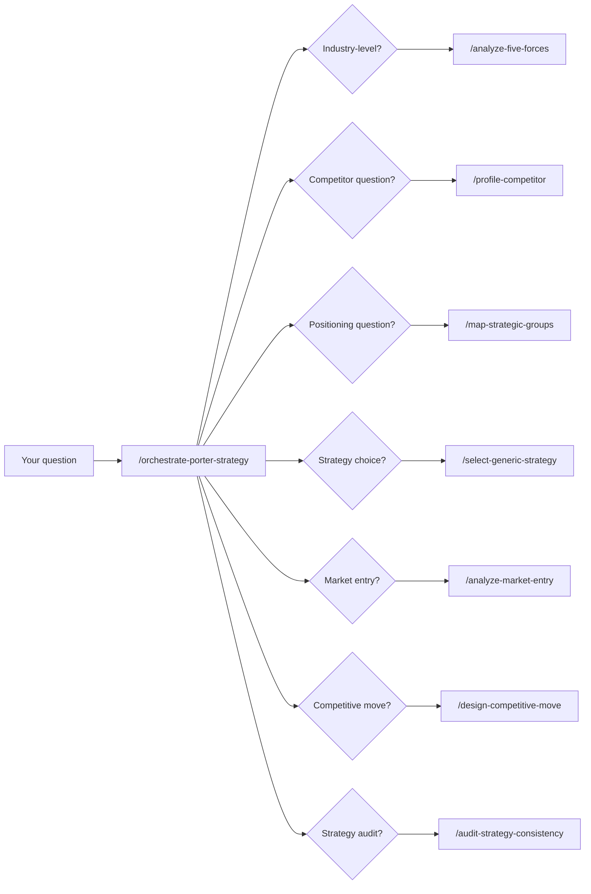
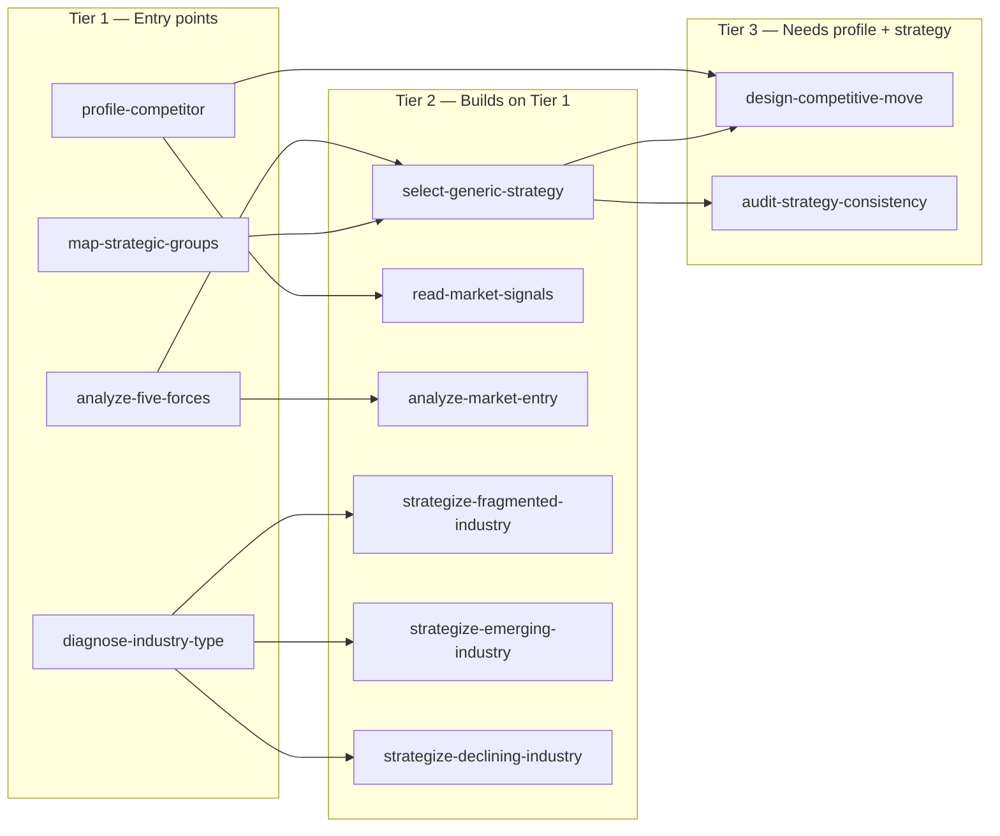

# Porter Competitive Strategy Skills


**Turn competitive strategy from abstract theory into structured analysis.**

12 executable skills + 1 orchestrator extracted from Michael Porter's *Competitive Strategy* — the foundational text on industry analysis and competitive positioning. Every skill was sense-checked against the original book via NotebookLM. Every sub-factor, checklist, and decision tree comes from Porter's own language, not summaries or interpretations.

Ask your agent to "analyze this industry" and get a structured five forces assessment with 32 sub-factors rated. Ask "what move should we make?" and get a commitment framework with retaliation predictions. Ask "are we stuck in the middle?" and get a diagnostic checklist with organizational requirements you're missing.


---

## Get started

```
/orchestrate-porter-strategy
```

The orchestrator detects what you're asking and routes to the right skill(s). Or invoke any skill directly:

```
/analyze-five-forces
/profile-competitor
/select-generic-strategy
```



---

## The 12 skills

Skills chain: a Tier 1 skill's output feeds directly into the Tier 2/3 skills that need it.



### Tier 1 — Entry points (no dependencies)

| Skill | What it does | Porter source |
|-------|-------------|---------------|
| `/analyze-five-forces` | Assess industry structure across 32 sub-factors (8 entry barriers, 8 rivalry drivers, 7 buyer power factors, 6 supplier power factors, 3 substitute indicators), identify governing forces, rate overall profit potential | Ch 1 |
| `/profile-competitor` | Build a four-component competitor profile (future goals, assumptions, current strategy, capabilities), generate a response profile predicting satisfaction, likely moves, vulnerabilities, and retaliation triggers | Ch 3 |
| `/map-strategic-groups` | Plot competitors across 13 strategic dimensions, select optimal axes, assess mobility barriers between groups, analyze per-group rivalry and bargaining power differences | Ch 7 |
| `/diagnose-industry-type` | Classify an industry as emerging, fragmented, transitioning to maturity, or declining using Porter's 14 evolutionary processes, then route to the appropriate industry-type strategy skill | Ch 8–12 |

### Tier 2 — Build on Tier 1 outputs

| Skill | What it does | Porter source |
|-------|-------------|---------------|
| `/select-generic-strategy` | Evaluate cost leadership, differentiation, and focus against your situation. Full requirements tables (skills, org arrangements, control systems), risk profiles, and a stuck-in-the-middle diagnostic | Ch 2 |
| `/read-market-signals` | Interpret competitor actions using Porter's 11-type signal taxonomy. Classify bluff vs. commitment, decode cross-parries and fighting brands, analyze historical behavior patterns | Ch 4 |
| `/analyze-market-entry` | Go/no-go entry analysis with barrier cost estimation, 7 generic entry mechanisms, incumbent retaliation modeling, sequenced entry assessment, and acquisition framework | Ch 16 |
| `/strategize-fragmented-industry` | Porter's 5-step process for fragmented industries. 11 fragmentation causes with overcomability assessment, 9 coping strategies, consolidation vs. cope recommendation | Ch 9 |
| `/strategize-emerging-industry` | Scenario-based forecasting, shape vs. adapt decision, pioneer vs. follower timing, 8 structural characteristics, shifting barrier analysis | Ch 10 |
| `/strategize-declining-industry` | End-game strategy selection using the 2x2 matrix (industry structure vs. firm strengths). 4 strategies (Leadership, Niche, Harvest, Divest) with hospitability assessment and exit barrier analysis | Ch 12 |

### Tier 3 — Requires competitor profile + strategy selection

| Skill | What it does | Porter source |
|-------|-------------|---------------|
| `/design-competitive-move` | Design offensive or defensive moves. Cooperative vs. threatening classification, mixed motives exploitation, commitment credibility framework, focal points, deny-the-base defense | Ch 5 |
| `/audit-strategy-consistency` | Test a strategy against Porter's 12 consistency checks across internal consistency, environmental fit, resource fit, and communication/implementation | Intro |

### Orchestrator

| Skill | What it does |
|-------|-------------|
| `/orchestrate-porter-strategy` | Detect intent, route to the right skill(s), chain outputs, accumulate context. 5 pre-built workflow shortcuts for common analyses |

---

## Pick your scenario

**"How attractive is this industry?"**
```
/analyze-five-forces
```
Walks through all 5 forces with every sub-factor Porter identifies. Produces a rated assessment with the governing force highlighted and strategic implications.

**"What will our competitor do next?"**
```
/profile-competitor
```
Builds a four-component profile, detects blind spots via assumption analysis, and predicts responses to your potential moves.

**"Should we enter this market?"**
```
/analyze-market-entry
```
Estimates true entry cost (not just visible investments), models incumbent retaliation, evaluates 7 entry mechanisms, and considers sequenced entry to lower risk.

**"We're in a crowded market with no dominant player"**
```
/strategize-fragmented-industry
```
Diagnoses why the industry is fragmented, whether consolidation is feasible, and which of 9 coping strategies fits your position.

**"Is our strategy coherent?"**
```
/audit-strategy-consistency
```
Runs 12 consistency tests from Porter's Figure 1-3. Flags where goals contradict policies, resources don't match ambitions, or timing is off.

**"What competitive move should we make?"**
```
/design-competitive-move
```
Designs a move that exploits mixed motives — where the competitor's rational response would hurt their own broader goals. Includes commitment requirements and escalation risk assessment.

---

## See it in action

> "Cursor responds not by defending the editor but by attacking Microsoft's layer — hosting. Textbook Porter: respond to an incursion in your market by moving into the initiator's core market."

**Why is Cursor investing in Origin?** A real analysis of Cursor's Origin announcement, run through this plugin's signal-reading and market-entry skills — [original thread](https://x.com/nurijanian/status/2073222501749105016).

<details>
<summary><strong>Read the full analysis</strong></summary>

### Baseline facts

Origin announced June 17, 2026 at Cursor's Compile conference — one day after SpaceX announced its $60B all-stock acquisition of Anysphere (option secured April 21, closing Q3 2026). Built by the Graphite team (acquired December 2025). Waitlist now, GA fall 2026. Claims: 22.6 commits/sec in one repo, 296K clones/hour, sub-400ms global sync, AI-driven merge-conflict resolution, stacked PRs native. Cursor is at ~$4B ARR, ~$2.6B from enterprise. GitHub's counter-position is Agent HQ (Universe 2025), which invites rival agents — including Claude Code, OpenAI, Cognition — into GitHub as the orchestration hub.

### Signal read

**Type:** Prior announcement of moves (Type 1) + discussion of own moves (Type 4 — the performance numbers exist to communicate "we spent real resources on this, don't dismiss it").

**Bluff vs. commitment:** Commitment, high confidence. Three markers: (1) formal, broad-audience medium at their own conference — hard to retract; (2) sunk cost — they bought Graphite six months earlier specifically for this; (3) stressing cost and difficulty (infra architecture, throughput demos) is Porter's classic earnest-commitment signal. The months-ahead announcement isn't conciliation; it's preemption — freezing enterprise buyers who might otherwise deepen GitHub Agent HQ commitments this year.

The most important classification: this is a **cross-parry**. Microsoft moved into Cursor's layer (Agent HQ makes GitHub the agent orchestration point, commoditizing the editor/agent layer). Cursor responds not by defending the editor but by attacking Microsoft's layer — hosting.

### Entry analysis: why code hosting is winnable for Cursor specifically

Barriers into git hosting are brutal in general: network effects (100M+ devs, OSS gravity), switching costs (CI/CD, integrations, compliance, audit history), and a price floor of free. A generic entrant dies here. Cursor's entry works because it stacks four of Porter's generic entry concepts at once:

1. **Discover a new niche** — agent-scale workloads. GitHub's infrastructure and UX assume human-scale concurrency: rate limits, merge queues, PR review designed for people. Hundreds of parallel agents cloning/rebasing the same repo breaks those assumptions.
2. **Offer a superior product** — for that niche: throughput, sync latency, machine-actionable review, automated conflict resolution.
3. **Piggybacked distribution** — the decisive one. Cursor doesn't need to win developers; it already has them. Every enterprise Cursor contract is a channel for Origin, entering through private enterprise repos — exactly where GitHub's network effects are weakest.
4. **Entry via acquisition** — Graphite gave them the review layer and team without building from scratch.

Sequencing: waitlist → existing Cursor enterprise teams → broader market. Not attacking OSS hosting, GitHub's fortress. Retaliation forecast: high probability but limited in form — GitHub can't cut price (already free), so expect faster Agent HQ shipping, deeper Copilot bundling into E5/Azure, and possibly friction on API access for Cursor. None of that stops entry through Cursor's own installed base.

### The strategic logic — angles beyond "GitHub isn't agent-ready"

1. **Removing dependence on a hostile complement.** Cursor's core product operates on top of infrastructure owned by its chief competitor. Microsoft owns the repo, the telemetry, the trigger points, and can degrade Cursor's position at will. Origin is vertical integration to eliminate a supplier-power problem — Porter's five forces applied to their own value chain.
2. **Owning the context is owning the moat.** The repo is where the data lives: codebase graph, review history, merge decisions, agent performance traces. Whoever hosts the code has the best context for training and steering coding agents.
3. **Repricing ahead of the seat-model collapse.** Cursor's revenue is largely per-human-seat. If agents write most code, seat counts stagnate — the better Cursor's agents get, the worse its own pricing model performs. Hosting and orchestration monetize by workload, not headcount.
4. **Value migration up the stack.** As code generation commoditizes, the scarce point shifts to reviewing, merging, and coordinating swarms of agents safely. Model → editor → agents → review → hosting: full vertical integration, with the repo as the anchor tenant.
5. **Counter-positioning.** GitHub can build agent-scale infrastructure, but rebuilding the forge around agents means disrupting workflows for 100M human users, Copilot's seat economics, and Microsoft's enterprise bundling. Cursor carries none of that legacy.
6. **SpaceX capital changes the retaliation math.** Backed by a $60B acquirer with no need for near-term software profits, Cursor can absorb a long, free-tier hosting war a standalone startup couldn't. The one-day gap between the acquisition announcement and Origin is itself a signal.

### What falsifies this play?

Enterprise inertia is the key assumption at risk — repos are the stickiest asset in the SDLC. If Cursor's enterprise base won't migrate repos even while happily using the editor, Origin becomes an expensive feature, not a platform. Second risk: GitHub ships credible agent-scale primitives inside Agent HQ before fall 2026 GA. Third: the SpaceX deal introduces buyer hesitancy over code custody inside a Musk-controlled entity.

### Net assessment

The "GitHub isn't built for agents" story is the wedge, not the reason. The reason: reduce reliance on Microsoft's platform, take control of the data and context layer, and shift revenue sources before AI agents reduce the value of per-seat pricing. Conditional GO by Porter's own entry test — distinctive advantage (installed base + Graphite + capital) lowers barrier costs below any other potential entrant's.

*Full disclosure: it's possible general model reasoning contributed to these results independent of the plugin's structure — worth re-running without it to isolate the effect. Since the plugin is free either way, that's a debate for another day.*

</details>

---

## Workflow shortcuts

The orchestrator includes 5 pre-built chains for common analyses:

| Workflow | Chain | Trigger |
|----------|-------|---------|
| Quick Industry Check | five-forces → diagnose-type → (type strategy) | "Analyze this industry" |
| Competitor Deep Dive | profile-competitor → read-signals | "Analyze [competitor]" |
| Should We Enter? | five-forces → market-entry | "Should we enter [market]?" |
| What Move? | profile-competitor → generic-strategy → competitive-move | "How should we compete?" |
| Full Strategic Audit | five-forces → strategic-groups → generic-strategy → consistency | "Full competitive analysis" |

---

## What's in the box

```
porter-strategy-skills/
├── skills/
│   ├── orchestrate-porter-strategy/SKILL.md
│   ├── analyze-five-forces/{SKILL.md, reference.md}
│   ├── profile-competitor/{SKILL.md, reference.md}
│   ├── map-strategic-groups/{SKILL.md, reference.md}
│   ├── diagnose-industry-type/{SKILL.md, reference.md}
│   ├── select-generic-strategy/{SKILL.md, reference.md}
│   ├── read-market-signals/{SKILL.md, reference.md}
│   ├── analyze-market-entry/{SKILL.md, reference.md}
│   ├── strategize-fragmented-industry/{SKILL.md, reference.md}
│   ├── strategize-emerging-industry/{SKILL.md, reference.md}
│   ├── strategize-declining-industry/{SKILL.md, reference.md}
│   ├── design-competitive-move/{SKILL.md, reference.md}
│   └── audit-strategy-consistency/{SKILL.md, reference.md}
└── references/source-summary.md ← Chapter coverage + known gaps
```

Each skill includes:
- Step-by-step procedure using Porter's exact language
- Exhaustive sub-factor checklists (not summaries)
- Decision logic for synthesizing findings into recommendations
- Structured output template
- Worked example showing input → output
- A `reference.md` in the same folder — Porter's heuristics and failure modes for that skill, expanded from the source text and loaded only when the skill consults it (not every run)

---

## What Porter covers that this plugin doesn't (yet)

| Gap | Porter Chapter | Why it's not here |
|-----|---------------|-------------------|
| Global industry strategy | Ch 13 | Multi-domestic vs. global competition framework — could warrant a `strategize-global-industry` skill |
| Vertical integration analysis | Ch 14 | Make-vs-buy, quasi-integration, tapered integration — could be its own skill |
| Capacity expansion | Ch 15 | Preemptive capacity, overbuilding dynamics — could fold into `design-competitive-move` |
| Buyer/supplier strategy | Ch 6 | Strategy toward specific buyers/suppliers beyond the five forces assessment |

---

## Installation

Every skill is a portable `SKILL.md` folder — install the whole plugin, or copy individual `skills/<name>/` folders (each is self-contained, including its `reference.md`).

### Claude Code

```
/plugin marketplace add gnurio/porter-strategy-skills
/plugin install porter-strategy-skills
```

Manual alternative: copy each `skills/<name>/` folder into `~/.claude/skills/` (personal) or `.claude/skills/` (project, commit it).

### Cursor

Install via the Cursor plugin marketplace, or copy each `skills/<name>/` folder into `~/.cursor/skills/` (personal) or `.cursor/skills/` (project).

### Codex CLI

Copy each `skills/<name>/` folder into `~/.agents/skills/` (personal) or `.agents/skills/` (project).

### VS Code (GitHub Copilot)

Copy each `skills/<name>/` folder into `.github/skills/` (project) or `~/.copilot/skills/` (personal) — Copilot also reads `.claude/skills/` and `.agents/skills/`.

---

## License

[CC BY 4.0](LICENSE) — free to use, share, and adapt with attribution.

Built by [George Nurijanian](https://github.com/gnurio) · [prodmgmt.world](https://prodmgmt.world)
